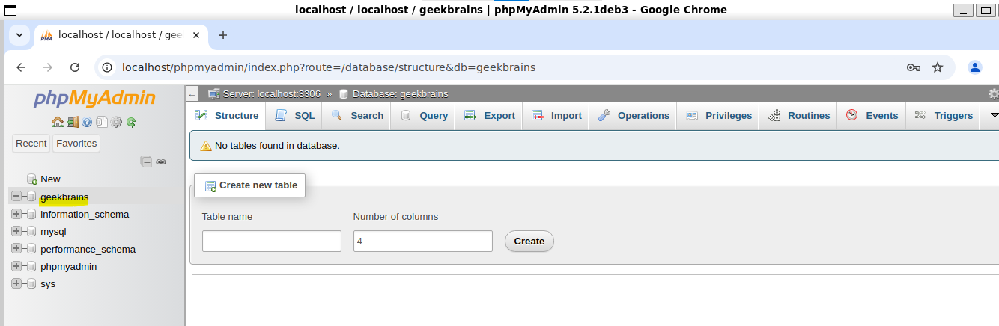
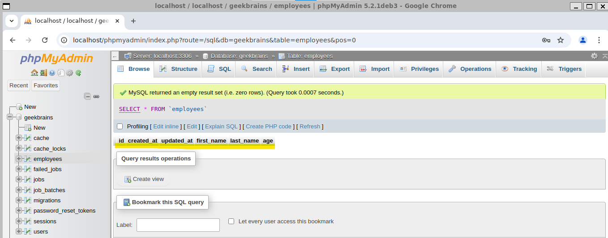
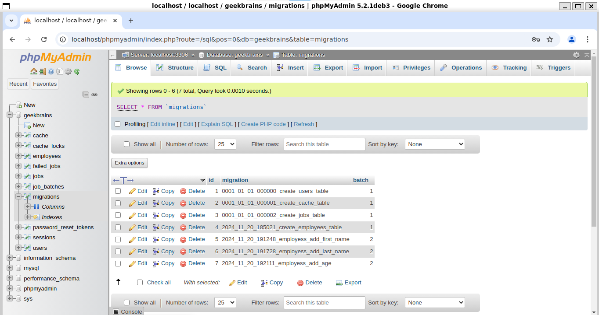
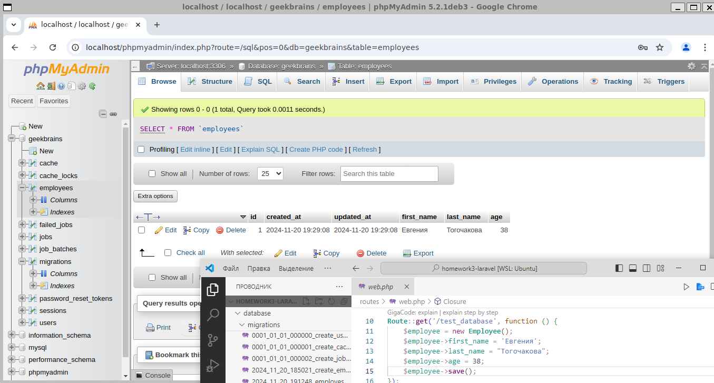

# Laravel. Homework 3. Тогочакова Евгения

Создайте базу данных, в ней — новую таблицу. Заполните поля, после чего сделайте выборку данных по указанным полям:

1. Для создания, просмотра и редактирования баз данных MySQL установите программу PhpMyAdmin.

2. Создайте базу данных с любым именем в PhpMyAdmin. Больше в нём ничего делать не нужно, остальное выполните в коде проекта.

3. В папке проекта настройте файл конфигурации для базы данных. 

4. Создайте проект Laravel с помощью composer, выполнив команду composer create-project laravel/laravel <имя проекта>.

5. В корне проекта создайте файл .env и укажите параметры подключения к базе данных. После редактирования файла .env выполните команду php artisan config:clear.

6. В папке проекта через командную строку создайте новую модель Employee. Одновременно с этим создайте файл миграции. 

7. С помощью команды php artisan migrate выполните миграции.

8. В файле routes/web.php создайте новый эндпоинт, например test_database:
```
Route::get('/test_database', function () {
//Код внутри колбэка
});
```
9. Внутри функции-колбэка напишите код, который создаст новый экземпляр модели Employee, и сохраните его в базу данных с помощью метода save().

10. Запустите локальный сервер Laravel с помощью команды php artisan serve.

11. Перейдите по ссылке <адрес вашего локального сервера>/test_database (по умолчанию http://localhost:8000/test_database).

12. Используйте phpMyAdmin, чтобы убедиться, что в вашей базе данных создались таблицы employees и migrations, а в таблице employees создалась новая строка, соответствующая экземпляру модели Employee.

13. Сделайте коммит своих изменений с помощью Git и отправьте push в репозиторий.
